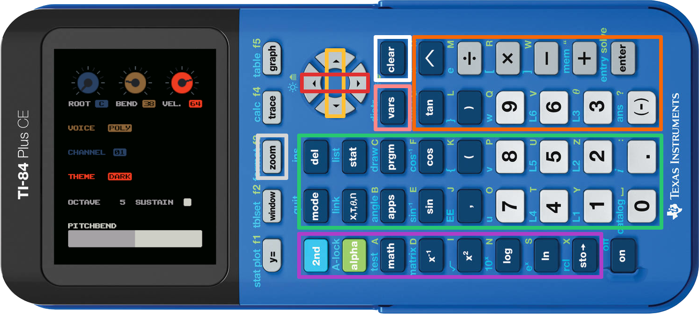

# midiCE 

This program lets you use your calculator as a USB MIDI keyboard. The program can be installed on any TI eZ80 calculators, which includes the TI-84 Plus CE, 83 Premium CE, and 82 Advanced Edition Python (along with other 84 and 83 color-screen variants such as the 84 Plus CE-T). It should work (no extra programs / drivers necessary) with any devices that allow USB MIDI input. 

## Installation

1. Download the latest version from [the GitHub releases page](https://github.com/TIny-Hacker/midiCE/releases/latest).
2. Send **MIDICE.8xp** to your calculator using [TI-Connect CE](https://education.ti.com/en/products/computer-software/ti-connect-ce-sw) or another linking software of your choice. If you don't have the [CE C libraries](https://tiny.cc/clibs), you'll need to download and send those as well.
3. Run **prgmMIDICE** from the programs menu (You will need to use the [arTIfiCE jailbreak](https://yvantt.github.io/arTIfiCE) if you are on an OS version 5.5 and above or are using the TI-82 AEP).

## Key Layout

## Usage

In order to use the program, you will need to connect your calculator to a device that can receive USB MIDI input.
You can use the same USB cable that you used to transfer the program earlier.

Below is a table with keys and their various usage:

| Key                                                                              | Action performed                                                                                                                                                               |
|----------------------------------------------------------------------------------|--------------------------------------------------------------------------------------------------------------------------------------------------------------------------------|
| <kbd>2nd</kbd> - <kbd>sto→</kbd> (circled in purple)                             | MIDI control input. Each set of two keys represents one control, where the left key decreases the control value and the right key increases it.                                |
| <kbd>mode</kbd> - <kbd>.</kbd> (circled in green)                                | MIDI note input. <kbd>mode</kbd> is the root note of the scale, with each horizontally adjacent key one whole step apart and each vertically adjacent key one half step apart. |
| <kbd>tan</kbd> - <kbd>enter</kbd> (circled in orange)                            | MIDI note input intended for drums (all notes are sent on channel 10).                                                                                                         |
| <kbd>vars</kbd>                                                                  | Sustain (continue playing any notes pressed until this key is released).                                                                                                       |
| <kbd>clear</kbd>                                                                 | Exit the program.                                                                                                                                                              |
| <kbd>←</kbd>, <kbd>→</kbd>                                                       | Increase (<kbd>→</kbd>) and decrease (<kbd>←</kbd>) the current octave.                                                                                                        |
| <kbd>↑</kbd>, <kbd>↓</kbd>                                                       | Increase and decrease the pitch bend value.                                                                                                                                    |
| <kbd>zoom</kbd>                                                                  | Lock / unlock the ability to modify settings.                                                                                                                                  |
| <kbd>2nd</kbd> (when modifying settings)                                         | Edit / save the value for the selected setting.                                                                                                                                |
| <kbd>↑</kbd>, <kbd>↓</kbd>, <kbd>←</kbd>, <kbd>→</kbd> (when modifying settings) | Select setting to modify or adjust the value of the selected setting.                                                                                                          |

## Bugs

If you encounter a bug while using midiCE, don't hesitate to [make an issue](https://github.com/TIny-Hacker/midiCE/issues)!

## Credits

Thanks to [Powerbyte7](https://github.com/powerbyte7) and [commandblockguy](https://github.com/commandblockguy/) for help with this project!

© 2023 - 2025 TIny_Hacker
